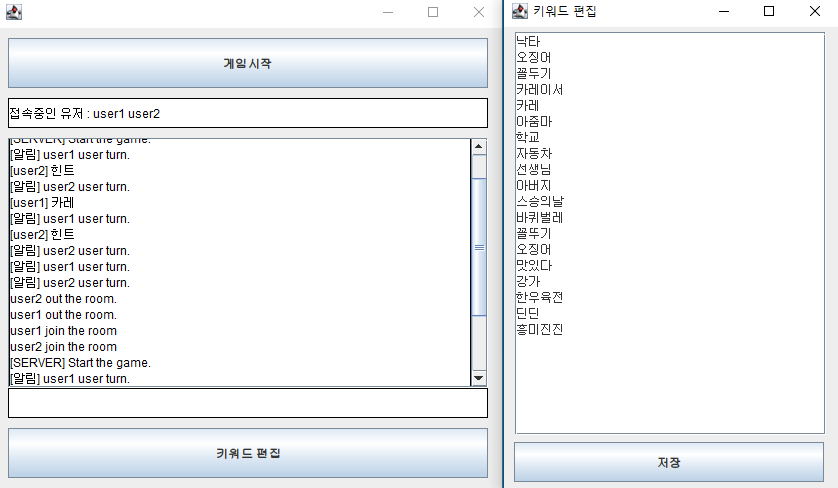

# Advanced_DrawMind

---------------------------------------
##### 광운대학교 2021학년도 2학기 오픈소스소프트웨어개발 프로젝트
##### [원본](https://github.com/dobidugi/drawMind)의 프로그램을 개선한 프로그램입니다.
##### 기본적인 게임 진행 방법은 위 링크를 참조해주세요.
---------------------------------------

## 개선점

##### 힌트 기능 추가
##### 브러쉬 크기 조절 기능 추가
##### 키워드 편집 기능 추가
##### 게임 내 타이머 기능 구현
##### 점수에 따른 순위 선정(미구현)

---------------------------------------

#### 힌트 기능 추가

##### 게임 중 "힌트" 입력 시 정답의 초성이 공개됩니다.

#### 브러쉬 크기 조절 기능 추가

##### +버튼과 -버튼을 이용해 브러쉬 크기 조절이 가능합니다.
##### 버튼을 한 번 누를 때마다 2픽셀씩 크기가 바뀝니다.

#### 키워드 편집 기능 추가

##### 서버의 첫 화면에 키워드 편집 버튼이 추가되었습니다.
##### 키워드들이 적혀있는 새 창이 나오게 되며, 키워드를 자유롭게 편집한 후 저장할 수 있습니다.

#### 게임 내 타이머 기능 구현

##### (위 gif파일은 가시성을 위해 빨리감기한 파일입니다.)
##### 게임의 각 라운드 당 60초의 제한시간이 구현되었습니다.
##### 10초마다 남은 시간이 채팅창에 표시됩니다.
##### 정답자 없이 60초가 지나게 될 경우 다음 문제로 넘어가게 됩니다.